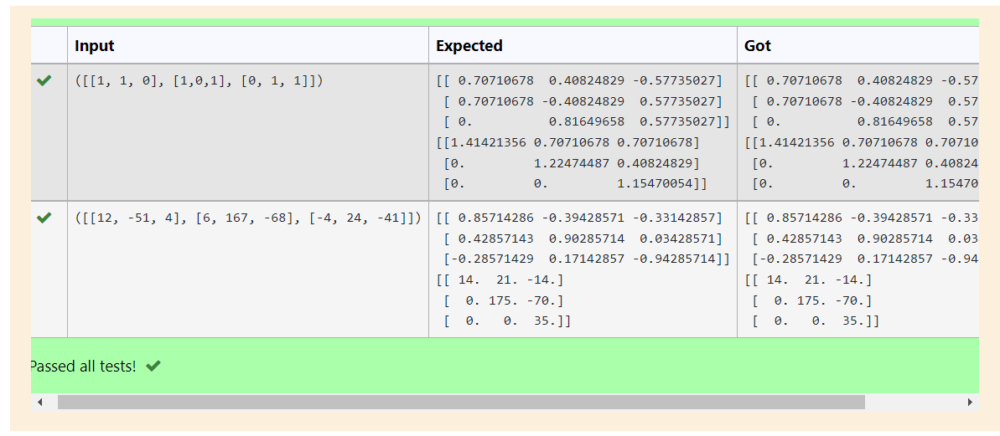

# Algorithm for QR Decomposition
## Aim:
To implement QR decomposition algorithm using the Gram-Schmidt method.
## Equipment’s required:
1.	Hardware – PCs
2.	Anaconda – Python 3.7 Installation / Moodle-Code Runner
## Algorithm:
1.	Intialize the matrix Q and u
2.	The vector u and e is given by

    

    

    

3.	Obtain the Q matrix   
    
4.	Construct the upper triangular matrix R
    


## Program:
### Gram-Schmidt Method
```

 
Program to QR decomposition using the Gram-Schmidt method
Developed by: ANISH MJ  
RegisterNumber: 21500369

import numpy as np
def QR_decom(A):
    n,m=A.shape #to get shape of A
    Q=np.empty((n,n)) #initialize Q matrix
    u=np.empty((n,n)) #initialize u ma=trix
    
    u[:,0]=A[:,0]    #u0=a0
    Q[:,0]=u[:,0]/ np.linalg.norm(u[:,0])  #Q0=e0; e0=u0/norm(u0)
    
    for i in range(1,n):
        
        u[:,i]=A[:,i] #ul=Ai
        for j in range(i):
            u[:,i] -=(A[:,i] @ Q[:,j])*Q[:,j] #to find u vector- u1,u2 
            
            Q[:,i]=u[:,i]/ np.linalg.norm(u[:,i]) #to find a values-which is Q matrix
            
    #to find R matrix
    
    R=np.zeros((n,m))
    for i in range(n):
        for j in range (i,m):
            R[i,j]=A[:,j]@Q[:,i]
    print(Q)
    print(R)
    
#get input
a=np.array(eval(input()))
QR_decom(a)


```

## Output




## Result
Thus the QR decomposition algorithm using the Gram-Schmidt process is written and verified the result.